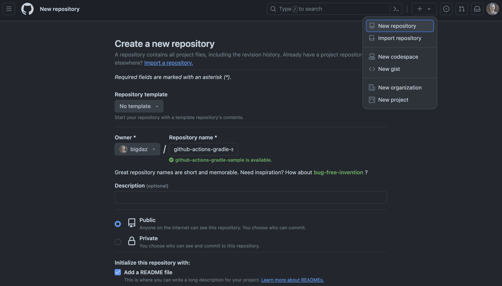
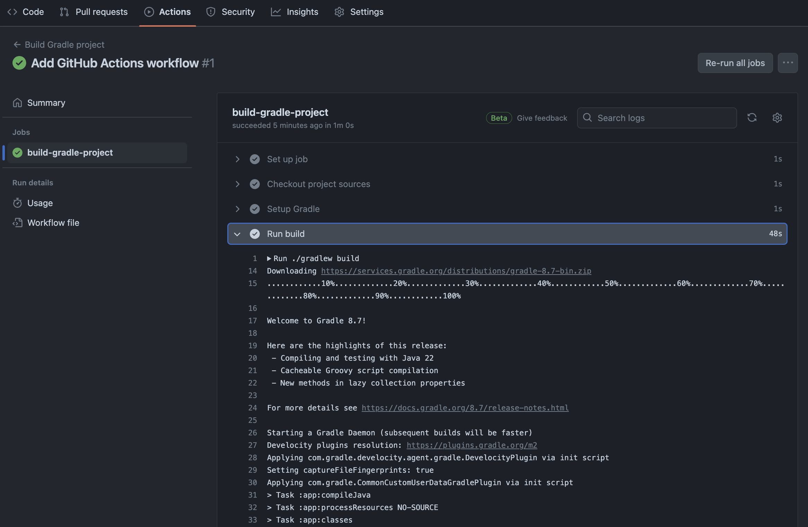
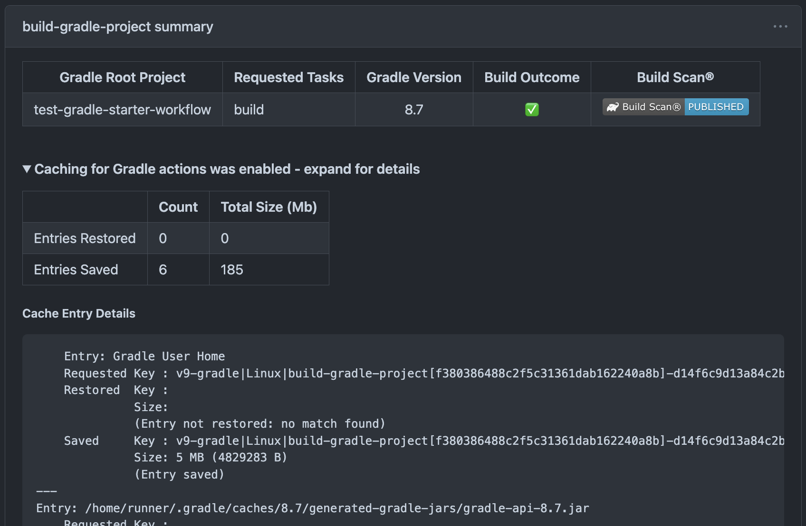
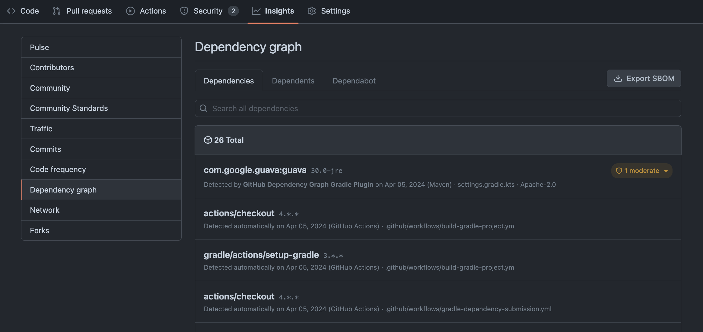
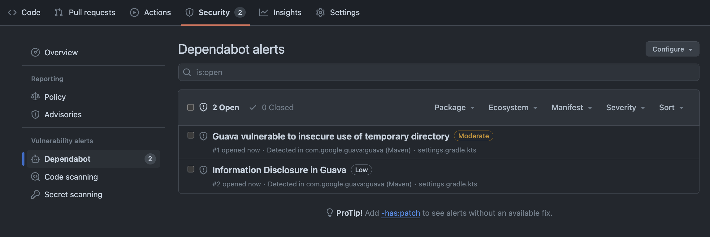

# Executing Gradle builds on GitHub Actions

!!! tip
    Top engineering teams using TeamCity have been able to reduce CI build time by up to 90% by using the Gradle Build Cache. [Register here](https://dpeuniversity.gradle.com/app/courses/ec69d0b8-9171-4969-ac3e-82dea16f87b0) for our Build Cache training session to learn how your team can achieve similar results.

Building Gradle projects doesn't stop with the developer's machine. [Continuous Integration](https://en.wikipedia.org/wiki/Continuous_integration) (CI) has been a long-established practice for running a build for every single change committed to version control to tighten the feedback loop.

In this guide, we'll discuss how to configure [GitHub Actions](https://github.com/features/actions/) for a Gradle project hosted on GitHub.

## Introduction

GitHub Actions is a cloud-based CI solution provider built directly into GitHub, making it an excellent choice for projects hosted on GitHub. Using the [setup-gradle](https://github.com/gradle/actions/tree/main/setup-gradle) GitHub Action makes it simple to integrate any Gradle project into a GitHub Actions workflow.

## What you'll need

* A text editor
* A command prompt
* The Java Development Kit (JDK), version 1.8 or higher
* A local Gradle installation, to initialize a new Gradle project
* A GitHub account

## Setup a Gradle project on GitHub

If you have an existing Gradle project hosted on GitHub, then you can skip this step and move directly to [Configure GitHub Actions](#configure-github-actions).

If not, follow these steps to initialize a new Gradle project on GitHub.

### Create a new GitHub repository for your project

Via the GitHub user interface, create a new repository named `github-actions-gradle-sample`.



### Clone the repository locally

```shell
$ git clone git@github.com:<YOUR-GITHUB-USER>/github-actions-gradle-sample.git
Cloning into 'github-actions-gradle-sample'...
$ cd github-actions-gradle-sample
```

### Initialize the Gradle project and commit to the repository

Use `gradle init` to create a fresh Gradle project. You can choose any of the available options during `init`, but we recommend choosing "library" as the project type.

Once the project is generated, commit the changes and push to the repository.

```shell
$ gradle init
$ git add .
$ git commit -m "Initial commit"
$ git push
```

### Test building the project

The project uses the [Gradle Wrapper](https://docs.gradle.org/current/userguide/gradle_wrapper.html) for building the project. It is a recommended practice for any Gradle project as it enables your project to be built on CI without having to install the Gradle runtime.

Before asking GitHub Actions to build your project, it's useful to ensure that it builds locally. Adding the "CI" environment variable will emulate running the build on GitHub Actions.

The following command achieves that:

```shell
$ CI=true ./gradlew build

BUILD SUCCESSFUL
```

If the build works as expected, we are ready to build it with GitHub Actions.

## Configure GitHub Actions

You can create a GitHub Actions workflow by adding a `.github/workflows/<workflow-name>.yml` file to your repository. This workflow definition file contains all relevant instructions for building the project on GitHub Actions.

The following workflow file instructs GitHub Actions to build your Gradle project using the Gradle Wrapper, executed by the default Java distribution for GitHub Actions. Create a new file named `.github/workflows/build-gradle-project.yml` with the following content, and push it to the GitHub repository.

```yaml
name: Build Gradle project

on:
  push:

jobs:
  build-gradle-project:
    runs-on: ubuntu-latest
    steps:
    - name: Checkout project sources
      uses: actions/checkout@v4

    - name: Setup Gradle
      uses: gradle/actions/setup-gradle@v3
      with:
        build-scan-publish: true
        build-scan-terms-of-use-url: "https://gradle.com/terms-of-service"
        build-scan-terms-of-use-agree: "yes"

    - name: Run build
      run: ./gradlew build
```

[Gradle Build Scans®](https://scans.gradle.com) are a great way to view your build results and provide valuable insights into your build. The workflow is configured to automatically publish a Build Scan for each build, accepting the legal terms of use. If you don't wish to publish Build Scans, you can remove this configuration from the workflow.

Commit the changes and push to the repository:

```shell
$ git add .
$ git commit -m "Add GitHub Actions workflow"
$ git push
```

## View the GitHub Actions results

Once this workflow file is pushed, you should immediately see the workflow execution in the GitHub Actions page for your repository (e.g., https://github.com/gradle/gradle/actions). Any subsequent push to the repository will trigger the workflow to run.

### List all runs of the GitHub Actions workflow

The main actions page can be used to list all runs for a GitHub Actions workflow.


### See the results for GitHub Actions workflow run

Clicking on the link for a workflow run will show the details of the workflow run, including a summary of all Gradle builds with links to any Build Scan published.

**TIP:** Configuring [build scans](https://scans.gradle.com) is especially helpful on cloud CI systems like GitHub Actions because it has additional environment and test results information that are difficult to obtain otherwise.


### View the details for Jobs and Steps in the workflow

Finally, you can view the logs for the individual workflow Jobs and each Step defined for a Job:



## Enable caching of downloaded artifacts

The [setup-gradle](https://github.com/gradle/actions/tree/main/setup-gradle) action used by this workflow will enable saving and restoring of the Gradle User Home directory in the built-in GitHub Actions cache. This will speed up your GitHub Actions build by avoiding the need to re-download Gradle versions and project dependencies, as well as re-using state from the previous workflow execution.

Details about what entries are saved/restored from the cache can be viewed in the generated Job Summary:



## Detect vulnerable dependencies with a dependency-submission workflow

[GitHub supply chain security](https://docs.github.com/en/code-security/supply-chain-security/understanding-your-software-supply-chain/about-supply-chain-security) features will detect and alert about any dependencies that have known vulnerabilities. In order to do this, GitHub requires a complete dependency graph for your project.

**NOTE:** Ensure that you have both [Dependency graph](https://docs.github.com/en/code-security/supply-chain-security/understanding-your-software-supply-chain/configuring-the-dependency-graph) and [Dependabot alerts](https://docs.github.com/en/code-security/dependabot/dependabot-alerts/configuring-dependabot-alerts#managing-dependabot-alerts-for-your-repository) enabled for your repository.

The [dependency-submission](https://github.com/gradle/actions/tree/main/dependency-submission) action for Gradle provides the simplest way to generate a dependency graph for your project. This action will attempt to detect and upload a list of all dependencies used by your build.

We recommend a separate GitHub Actions workflow for dependency submission. Create a GitHub Actions workflow by adding a `.github/workflows/<workflow-name>.yml` file to your repository. Create a new file named `.github/workflows/gradle-dependency-submission.yml` with the following content, and push it to the GitHub repository.

```yaml
name: Gradle Dependency Submission

on:
  push:
    branches:
    - main

jobs:
  dependency-submission:
    runs-on: ubuntu-latest
    steps:
    - name: Checkout project sources
      uses: actions/checkout@v4

    - name: Generate and submit dependency graph
      uses: gradle/actions/dependency-submission@v3
      with:
        build-scan-publish: true
        build-scan-terms-of-use-url: "https://gradle.com/terms-of-service"
        build-scan-terms-of-use-agree: "yes"
```

[Gradle Build Scans®](https://scans.gradle.com) are a great way to view your build results and provide valuable insights into your build. The workflow is configured to automatically publish a Build Scan for each build, accepting the legal terms of use. If you don't wish to publish Build Scans, you can remove this configuration from the workflow.

Commit the changes and push to the repository:

```shell
$ git add .
$ git commit -m "Add Dependency submission workflow"
$ git push
```

### Viewing the dependency graph

Once the dependency-submission workflow has completed, you can view all reported dependencies by navigating to `Insights -> Dependency graph`.

This image reveals that the repository contains a version of `com.google.guava:guava` with a moderate vulnerability.



### Viewing all dependency alerts

You can view a list of all vulnerabilities by navigating to `Security -> Dependabot`.

